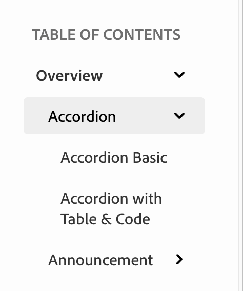

# Side Navigation Configuration

Side Navigation (sidebar) is configured in the `config.md` file using the `subPages` section. It creates a hierarchical navigation menu that appears on the left side of your documentation pages.

## Configuration Example

```yaml
- subPages:
    - [Overview](blocks/index.md)
      - [Accordion](/blocks/accordion/index.md)
        - [Accordion Basic](/blocks/accordion/accordion-basic.md)
        - [Accordion with Table & Code](/blocks/accordion/accordion-with-table-and-code.md)
      - [Announcement](/blocks/announcement/index.md)
        - [Announcement Button only](/blocks/announcement/announcement-button-only.md)
        - [Announcement With Heading](/blocks/announcement/announcement-with-heading.md)
      - [Edition](/blocks/edition/index.md)
        - [Edition without Link](/blocks/edition/edition-with-no-link.md)
        - [Edition with Link](/blocks/edition/edition-with-link.md)
```

## How It Works

The `subPages` array creates a hierarchical sidebar menu with multiple nesting levels.

**Hierarchy:**
- No indentation = Top-level section
- 2 spaces indentation = Subsection
- 4 spaces indentation = Nested page

### Visual Result

The above configuration creates this sidebar structure:



## Format

Each entry follows the format: `[Display Text](relative/path.md)`

- `[Accordion]` - The text displayed in the sidebar
- `(/blocks/accordion/index.md)` - The relative path to the page under `src/pages/`

Paths can start with or without `/` - both resolve relative to `src/pages/`.

**Example:**
- `[Accordion](/blocks/accordion/index.md)` displays "Accordion" and links to `src/pages/blocks/accordion/index.md`

## Path Resolution

All paths are relative to `src/pages/` and work with the `pathPrefix` setting:

| Config Path | Actual File Location | Full URL (with pathPrefix) |
| --- | --- | --- |
| `blocks/index.md` | `src/pages/blocks/index.md` | `/dev-docs-reference/blocks/` |
| `/blocks/accordion/index.md` | `src/pages/blocks/accordion/index.md` | `/dev-docs-reference/blocks/accordion/` |
| `/blocks/accordion/accordion-basic.md` | `src/pages/blocks/accordion/accordion-basic.md` | `/dev-docs-reference/blocks/accordion/accordion-basic` |

## Best Practices

- Keep nesting levels to 2-3 maximum for better user experience
- Ensure indentation is consistent (2 spaces per level)
- All paths must point to existing files under `src/pages/`
- Organize sidebar navigation to match your file structure
- Use clear, descriptive labels for each section

## Related

For configuring top navigation, see the [TopNav](/blocks/topnav/index.md) documentation.

